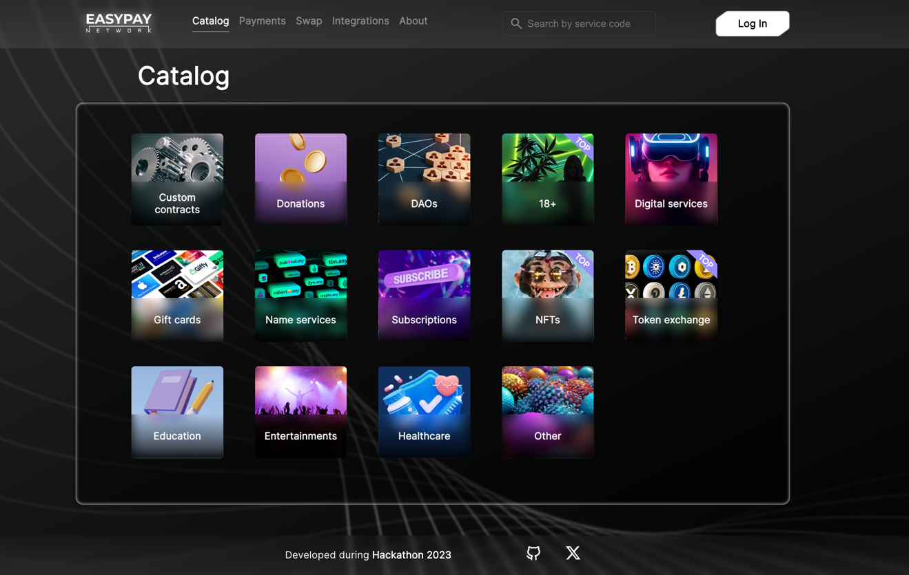
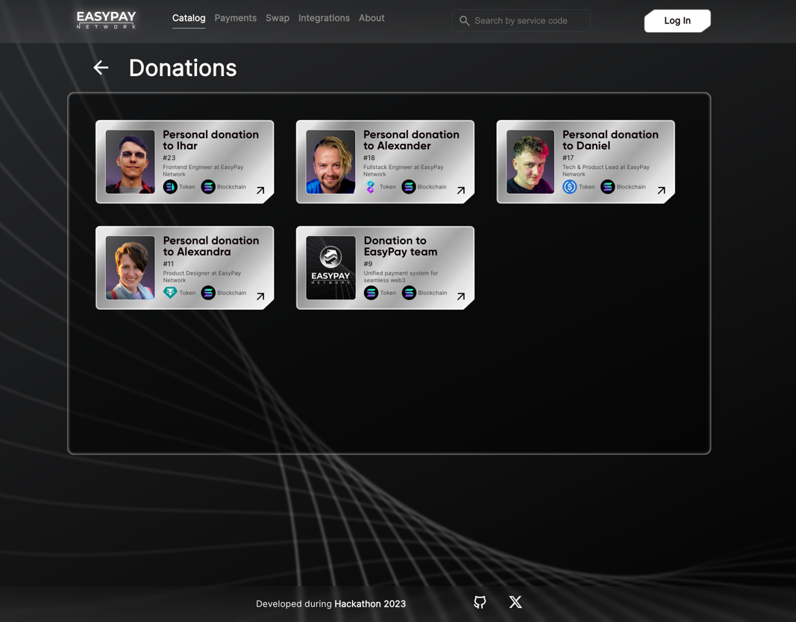
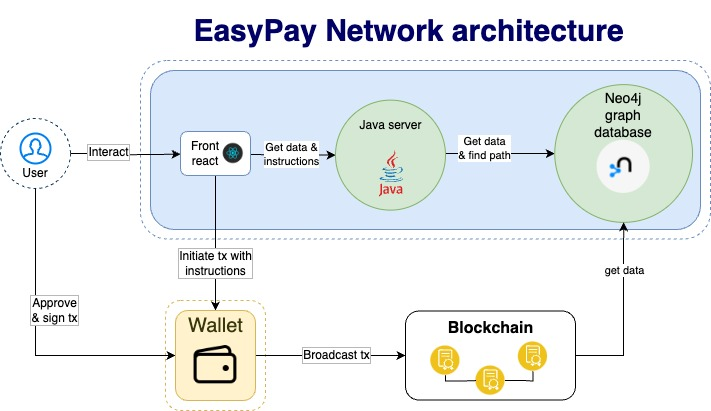

# Solana hyperdrive hackathon 2023

> **Boost blockchain economy to the new level by eliminating user fragmentation, enhancing liquidity, and unifying markets across the entire web3!**

* [easypay.network](https://easypay.network) - a web-site/dapp that clearly shows how you can work with EasyPay Network.
* [github.com/easypay-network](https://github.com/easypay-network) - github project repository, which contains all the developments of this project during **Hackathon 2023**.

## Content
* [Content](#Content)
* [Interface](#Interface)
* [Architecture](#Architecture)
* [Database](#Database)
* [Protocol](#Protocol)
* [Repositories](#Repositories)

## Interface

### Catalog
CATEGORIES                          |  ITEMS MINI                         |  ITEMS DETAILED                     |
:----------------------------------:|:-----------------------------------:|:-----------------------------------:|
  |   |  |
|                                   |   |  |

### Login
NO ONE                              |  ALL                                |
:----------------------------------:|:-----------------------------------:|
  |   |

### Swap
INITIAL PAGE                        |  PATH EXAMPLE                        | APPROVE                            |
:----------------------------------:|:------------------------------------:|:----------------------------------:|
  |    |  |
|                                   |                                      |  |

### BY SERVICE CODE & REFERENCE NUMBER
SEARCH OPTIONS                      |  FINDED ITEM                         |
:----------------------------------:|:------------------------------------:|
 |   |

### REPORTS
TYPES                                |  TIMELINE                            | STUB                                |
:-----------------------------------:|:------------------------------------:|:-----------------------------------:|
  |   |  |

### INVOICES
CONSTRUCTOR                          |  LIST                                | DETAILS                             | PAYMENT                             |
:-----------------------------------:|:------------------------------------:|:-----------------------------------:|:-----------------------------------:|
  |   |  |  |

### INVOICE PAYMENT
REQUIREMENTS                          |  PROCESSING MODAL                    | SUCCESS MODAL                       | PAYMENT                             | EXPLORER                            |
:-----------------------------------:|:------------------------------------:|:-----------------------------------:|:-----------------------------------:|:-----------------------------------:|
  |   |  |  |  |

## Architecture

## Database

> **Graph database Neo4j with pathfinding algorithm**

## Protocol

## Repositories

* [easypay-network/HYPERDRIVE-2023](https://github.com/easypay-network/HYPERDRIVE-2023) - EasyPay Network project root documentation repository
* [easypay-network/hackathon-frontend](https://github.com/easypay-network/hackathon-frontend) - dApp for interacting with our EasyPay Network Payment System.
* [easypay-network/hackathon-server](https://github.com/easypay-network/hackathon-server) - CosmWasm Inter-blockchain protocol implementation
* [easypay-network/hackathon-database](https://github.com/easypay-network/hackathon-database) - cypher scripts for neo4j database
